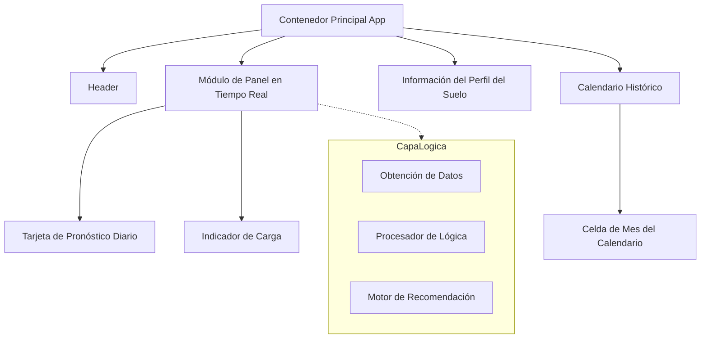

# Documentación de Arquitectura

## Visión General

El **Asistente de Siembra Inteligente** es una Aplicación de Página Única (SPA) basada en React diseñada para asistir en la toma de decisiones de reforestación en climas semiáridos. Analiza datos meteorológicos en tiempo real y tendencias históricas para recomendar ventanas de siembra óptimas basadas la saturación de humedad del suelo.

## Arquitectura Física

- **Cliente**: Aplicación React basada en navegador.
- **Alojamiento**: Alojamiento web estático (estructura implícita).
- **Servicios Externos**:
    - **API Open-Meteo**: Utilizada para obtener datos meteorológicos históricos (últimos 7 días) y de pronóstico (próximos 7 días).
      - Endpoint: `https://api.open-meteo.com/v1/forecast`
      - Parámetros: Latitud 38.27, Longitud -0.70 (Elche, España).

## Arquitectura Lógica

La aplicación está estructurada como una colección de componentes funcionales de React gestionados por un contenedor principal.

### Estructura de Componentes

### Descripción de Componentes

| Componente | Descripción | Dependencias |
|-----------|-------------|--------------|
| `App` | Contenedor de diseño principal. Orquesta las secciones de alto nivel. | React, Lucide Icons |
| `LiveDashboard` | El módulo funcional central. Gestiona el estado de los datos meteorológicos, maneja las llamadas a la API, ejecuta la lógica de recomendación (`processAndRecommend`) y renderiza el consejo en tiempo real. | `useState`, `useEffect` |
| `SoilProfileCard` | Componente informativo estático que muestra las características del suelo (Aridisol) y explicaciones de los umbrales. | Lucide Icons |
| `ForecastDay` | Componente de presentación para el pronóstico del tiempo de un solo día. | Lucide Icons |
| `LoadingSpinner` | Retroalimentación de la interfaz de usuario durante la obtención asíncrona de datos. | - |
| `CalendarCell` | Componente de presentación para celdas de cuadrícula de datos históricos, codificadas por colores según viabilidad. | - |

## Flujo de Datos

1.  **Inicialización**: `LiveDashboard` se monta y activa `useEffect`.
2.  **Adquisición de Datos**: `fetchWeatherData` llama a la API de Open-Meteo.
3.  **Procesamiento**:
    *   Los datos se analizan para extraer sumas de precipitación diaria y probabilidades.
    *   **Últimos 7 Días**: Se suman para calcular la reserva actual de humedad del suelo.
    *   **Próximos 7 Días**: Se analizan para encontrar el próximo evento de lluvia significativo (>1mm, >30% prob).
4.  **Toma de Decisiones**: `processAndRecommend` aplica reglas de negocio (ver [Lógica de Negocio](BUSINESS_LOGIC.md)) para determinar el nivel de alerta (Rojo, Amarillo, Verde, Azul).
5.  **Renderizado**: El estado se actualiza (`setRecommendation`, `setWeatherData`), provocando que la interfaz de usuario se vuelva a renderizar con el consejo y los colores apropiados.

## Stack Tecnológico

- **Framework**: React 18
- **Herramienta de Construcción**: Create React App (react-scripts)
- **Estilos**: Tailwind CSS (CSS utilitario)
- **Iconos**: Lucide React
- **Lenguaje**: JavaScript (ES6+)
