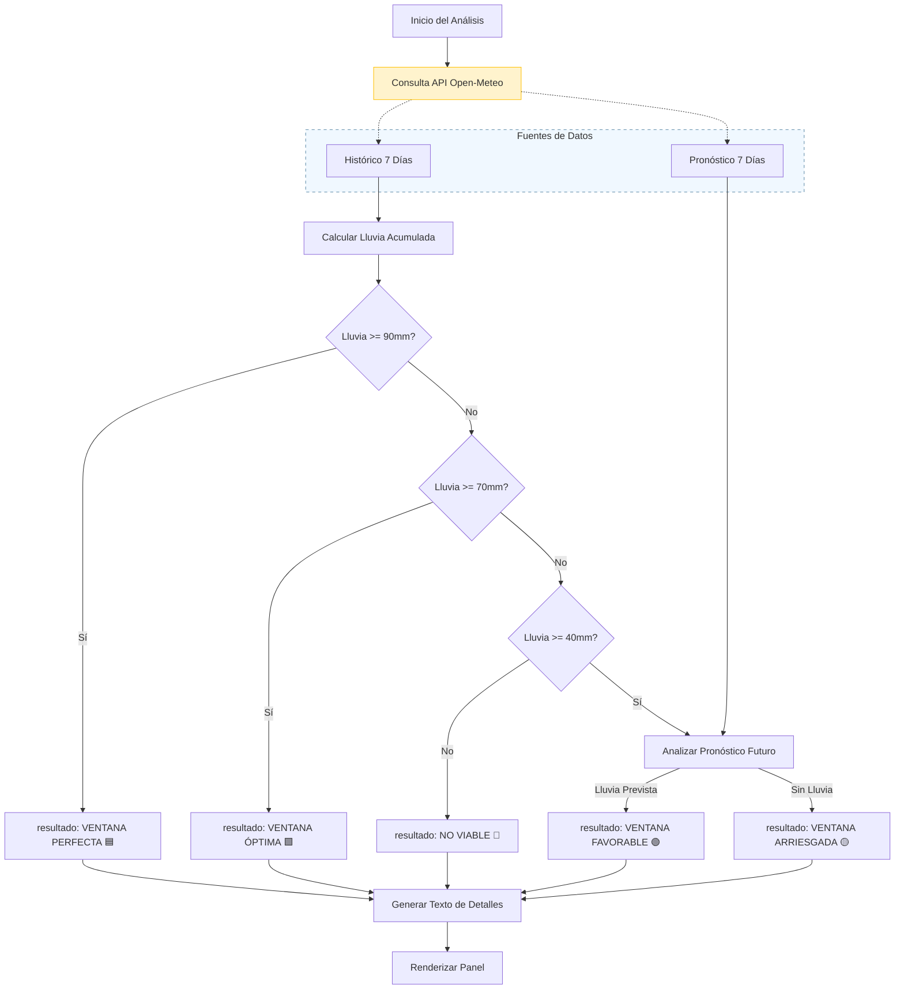

# Lógica de Negocio y Reglas

Este documento detalla la lógica de toma de decisiones utilizada por el **Asistente de Siembra Inteligente**. El sistema evalúa la disponibilidad de humedad del suelo basándose en las precipitaciones recientes y los pronósticos futuros para recomendar ventanas de siembra.

## Conceptos Clave

### 1. Lluvia Acumulada (Reserva del Suelo)
El sistema calcula la precipitación total acumulada durante los **últimos 7 días**. Esta métrica sirve como indicador indirecto de la saturación de humedad del suelo.
- **Variable**: `sevenDayTotal`
- **Fuente**: Open-Meteo `daily.precipitation_sum` (últimos 7 días).

### 2. Lluvia de Seguimiento (Garantía de Supervivencia)
El sistema analiza el pronóstico para los **próximos 7 días** para identificar el "Día de la Próxima Lluvia".
- **Definición de Día de Lluvia**:
    - Suma de Precipitación > **1.0 mm**
    - Y Probabilidad de Precipitación > **30%**
- **Variable**: `daysToNextRain` (Índice calculado del primer día coincidente + 1).

## Motor de Reglas de Recomendación

El sistema clasifica las condiciones en 4 niveles de viabilidad basados en `sevenDayTotal` y `daysToNextRain`.

### Matriz de Decisión

| Lluvia Acumulada (Últimos 7 Días) | Condición de Lluvia de Seguimiento | Nivel de Viabilidad | Título de Estado | Lógica / Razonamiento |
| :--- | :--- | :--- | :--- | :--- |
| **>= 90 mm** | Cualquiera | 🟦 **Azul** | **Ventana Perfecta** | Saturación profunda del suelo lograda. Condiciones ideales independientemente del pronóstico inmediato. (Se añade advertencia si no hay lluvia en >7 días). |
| **>= 70 mm** | Cualquiera | 🟩 **Verde** | **Ventana Óptima** | Humedad suficiente para alcanzar capas profundas. (Se añade nota de riesgo si no hay lluvia en >10 días). |
| **>= 40 mm** | Lluvia en ≤ 5 días | 🟢 **Esmeralda** | **Ventana Favorable** | Existe humedad superficial. La lluvia de seguimiento asegura la supervivencia de la plántula. |
| **>= 40 mm** | No hay lluvia en 5 días | 🟡 **Amarillo** | **Ventana Arriesgada** | Existe humedad superficial pero alto riesgo de desecación debido a la falta de lluvia de seguimiento inmediata. |
| **< 40 mm** | Cualquiera | 🔴 **Rojo** | **No Viable** | Humedad acumulada insuficiente. No se recomienda la siembra. |

### Diagrama de Flujo Lógico

## Contexto del Perfil del Suelo (Reglas Estáticas)

La aplicación asume características específicas del suelo para el área objetivo (Elche, Alicante):
- **Tipo**: Aridisol.
- **Rasgos**: Baja materia orgánica, acumulación de sales (carbonatos), riesgo de costra superficial.
- **Implicación**: Las altas tasas de evaporación hacen que la "Lluvia de Seguimiento" sea crítica para escenarios de acumulación media (40-70mm). La acumulación baja (<40mm) se rechaza porque probablemente se evapore antes de alcanzar la profundidad de la raíz.

## Restricciones de Datos y API
- **Ubicación**: Codificada (hardcoded) a `Lat: 38.27`, `Lon: -0.70`.
- **API**: Open-Meteo V1.
- **A prueba de fallos**: Si la API falla, muestra mensaje de error; no almacena en caché resultados anteriores (sin estado).
